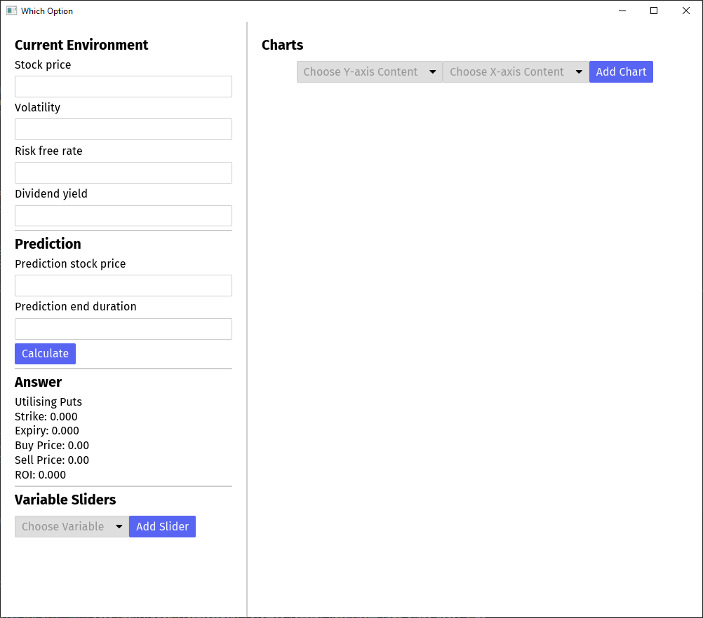
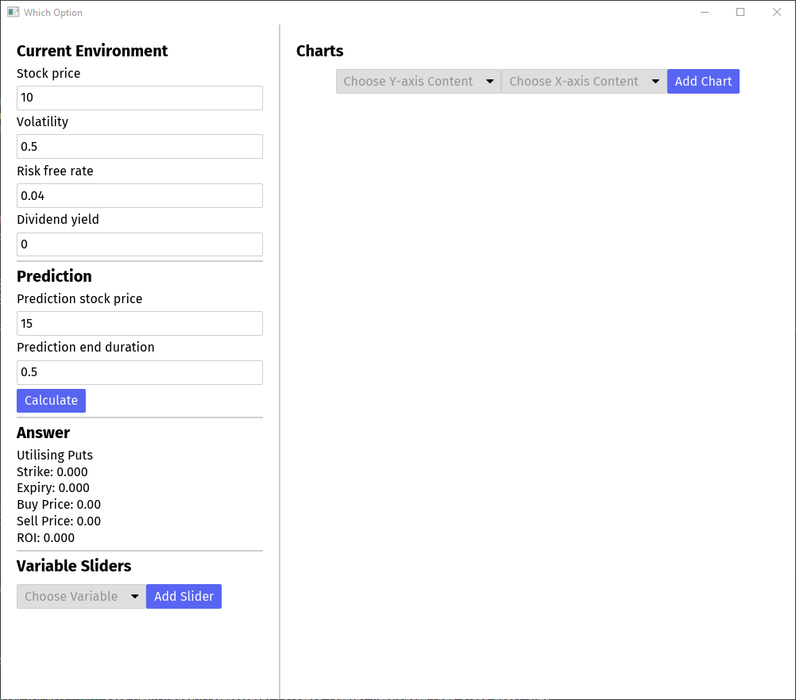
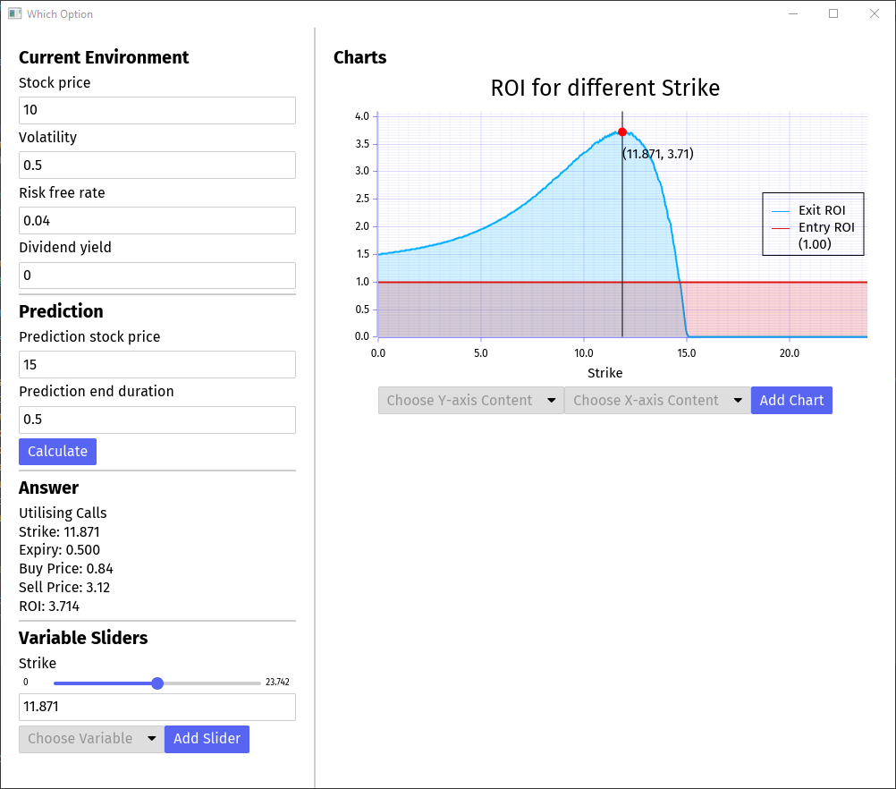

# Which Option
Finance options calculator to inform you what strike and expiry to purchase

## How is it Different From Other Tools?
To be honest, it is not much different from other options tooling. However, the main layout and end goals are different from other tools.
 - Most other tools are designed for visualising payoff graphs given a portfolio of options. I.e payoff graphs and risk management are the main focuses.

The main goal of this tool is to answer the question: "Given a stock moves to a **given price in a given time duration**, **what option** should I purchase now to **maximise ROI?**".
 - Of course, no one knows for certainty how a stock will move, so this tool mainly designed to help with ~~my gambling addiction~~ a trader's speculative decisions
 - I.e maximising ROI for a specific scenario is the first priority. Payoff graphs and risk management come later.

This tool is also meant to be small, simple and straight to the point. (See down below for further details)

## Summary
Important details/notes/bugs about the tool:
 - The tool **only considers purchasing a single call/put option**. Any possibilities of multi-option portfolios are ignored.
 - All numerical environment data must be fed in manually
    - E.g there are no integrations to automatically pull in options pricing data
 - Option contract sizes are assumed to be 1
 - Black-Scholes pricing model is used
 - Prices are rounded to 2 d.p (nearest cent) in the direction that makes practical sense
    - When purchasing an option, prices are rounded up
    - When selling an option, prices are are rounded down
    - The ROI payoff graphs can look quite jagged due to this
 - When calculating the optimal strike and expiry, gradient ascent is used on non-rounded calculations of Black-Scholes
    - Due to this, the "optimal" contract selected may not be the absolute highest point on the ROI payoff graphs (since the payoff graphs implement rounding)
 - IV is assumed to be constant across time and for all option strikes/expiries
    - This is probably the **biggest flaw of the tool**
    - I.e it pretends volatility smile doesn't exist

## Quick Guide
The calculator requires inputs of the "Current Environment" and your "Prediction".

Lets say we are speculating on stock XYZ. 

We check the stock ticker with our preferred brokerage app and fill in the "Current Environment" variables with the following:
 - "Stock Price": Market price of XYZ
 - "Volatility": The market IV of XYZ. (Recommendation is to use IV figures from options 6 months away from expiry).
 - "Risk free rate": The current risk free rate. (I.e yield rate of short term government bills).
 - "Dividend yield": The dividend yield of XYZ

For our example we will say that:
 - "Stock Price": 15
 - "Volatility": 0.5
 - "Risk free rate": 0.04
 - "Dividend yield": 0

We speculate the XYZ will reach $15 in 6 months (0.5 years). We will thus fill in the "Prediction" variable with:
 - "Prediction stock price": 15
 - "Prediction end duration": 0.5

We then hit the "Calculate" and...

### Interpreting the Answer
The answer will show the call/put option to purchase immediately that maximises ROI assuming that:
 - The prediction becomes perfectly true
 - The option is sold at the prediction end duration

So in the image above, the answer says that if the "$15 in 6 months" prediction becomes true, we should:
1. Immediately purchase a $11.87 strike call option with 6 months to expiry for the price of $0.84
2. Sell the call option in 6 months time for the price of $3.12

### Manipulating Variables
We could obviously not be totally confident in our prediction. 
 - Our prediction could be wrong and the XYZ ends up at $11 in 6 months time. This would make the option given for the answer expire worthless and our ROI becomes 0.

To hedge against this we may want to explore our ROI for different ending prices and also different strikes chosen for the option. Things like this can be easilly done by adding "variable sliders" and adding more payoff charts.

https://github.com/user-attachments/assets/d69847a1-6c66-4f2f-a7ac-71983d911dd2

## Compiling From Source
Clone/download the repo and execute either of the following commands:
 - `cargo run` to compile and run a native version
 - `trunk serve` to compile and host a web version
